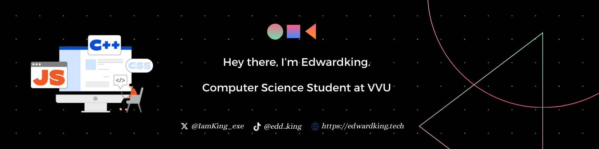
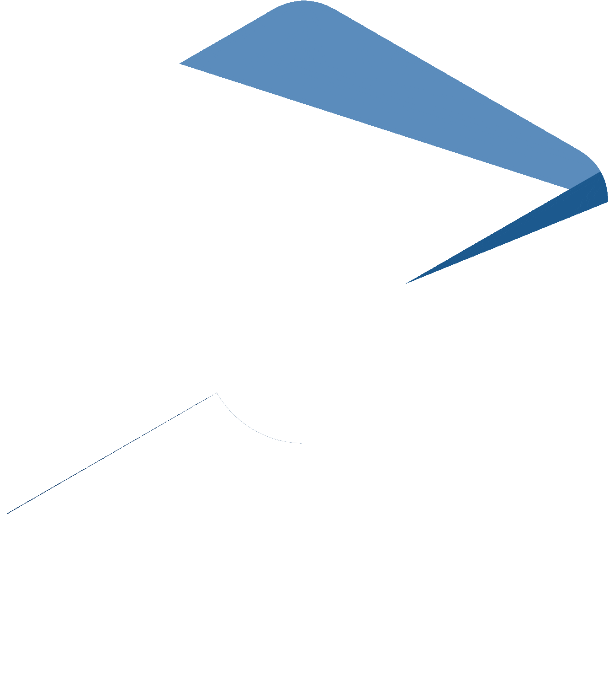
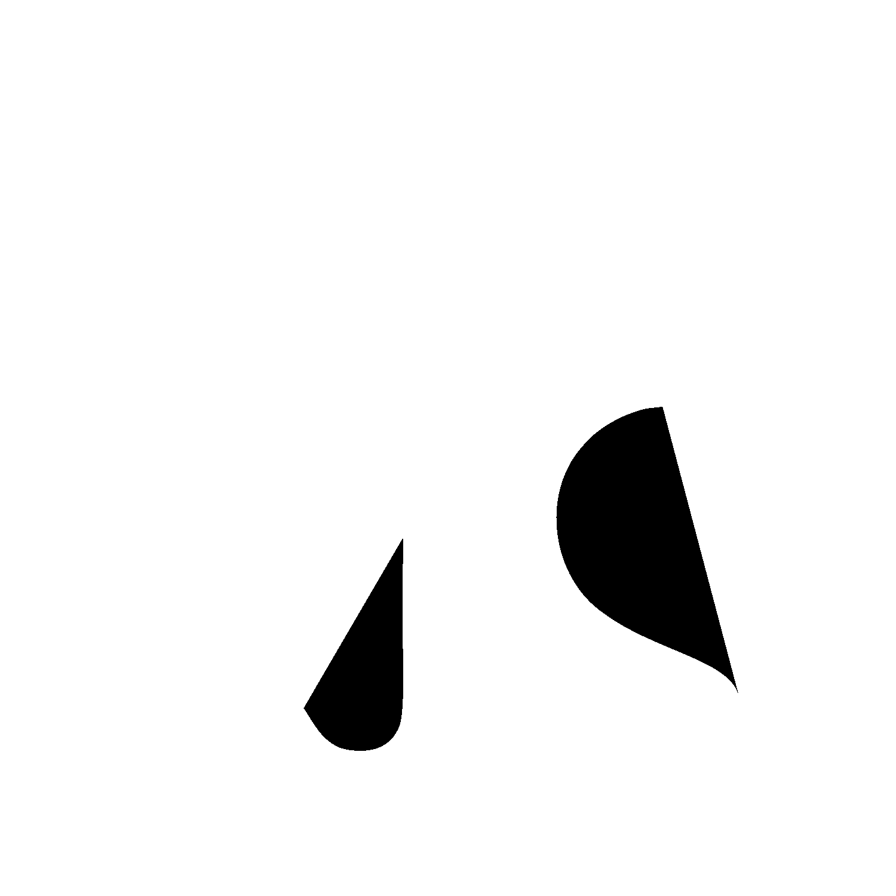

  

## ▪️ About Me ▪️ 
 
Hello World! 👋 I'm Edwardking, a Computer Science student on an exhilarating journey to become a full-stack developer.  
But why stop there? My curiosity is as boundless as the cloud itself, and that's where I'm headed next. Cloud 
computing is on my horizon, and I'm eager to explore the vast expanse of scalable solutions and distributed systems.  
 
Ultimately, my compass points towards the enigmatic and ever-evolving world of AI   and Machine Learning. 
  It's here that I aim to merge my passion for technology with  the power of algorithms, driving innovation that learns, adapts, and improves. 
   
  Technology has always been my playground, and computers, my loyal companions. I thrive on problem-solving and relish challenges that stretch the limits of imagination, creativity, and logical thinking.
   
   

  ## ▪️ Learning Progress ▪️ 
 
   
   
  

        
 
             &nbsp;&nbsp;&nbsp;&nbsp;&nbsp;&nbsp;&nbsp;&nbsp;&nbsp;
             &nbsp;&nbsp;&nbsp;&nbsp;&nbsp;&nbsp;&nbsp;&nbsp;&nbsp;
            
        

  
 &nbsp;&nbsp;&nbsp;&nbsp;  &nbsp;&nbsp;&nbsp;&nbsp;     

 
 
       &nbsp;&nbsp;&nbsp;&nbsp;&nbsp;&nbsp;&nbsp;&nbsp;&nbsp;
      
 

 
   &nbsp;&nbsp;&nbsp;&nbsp;   

  

   

  ## ▪️ Projects ▪️

  

### Projects
- **C++ E-Commerce Console App** - Check out the [project repository](https://github.com/Eddking-QS/Projects-eCommerce_App) for more details.

### Mini Projects
- **Cookie Monster Portfolio Website** - Check out the [project repository](https://github.com/Eddking-QS/HTML-Mini-Project-CookieMonster) for more details.
- **CatPhotoApp** - Check out the [project repository](https://github.com/Eddking-QS/HTML-Mini_Projects-CatPhotoApp) for more details.
- **Cafe Menu** - Check out the [project repository](https://github.com/Eddking-QS/CSS-Mini_Projects-Cafe_Menu) for more details.
- **CSS Color Markers** - Check out the [project repository](https://github.com/Eddking-QS/CSS-Mini_Project-Markers) for more details.
- **Registration Form** - Check out the [project repository](https://github.com/Eddking-QS/HTML-Mini_Projects-Registration_Form) for more details.
- **Rothko Painting** - Check out the [project repository](https://github.com/Eddking-QS/CSS_Mini-Projects_Rothko_Painting) for more details.
- **Gallery** - Check out the [project repository](https://github.com/Eddking-QS/CSS-Mini_Projects-Gallery) for more details.
- **Nutrition Label** - Check out the [project repository](https://github.com/Eddking-QS/CSS-Mini_Projects-Nutrition_Label) for more details.

### FCC Certification Projects
- **Survey Form** - Check out the [project repository](https://github.com/Eddking-QS/FCC-Survey_Form) for more details.
- **Tribute Page** - Check out the [project repository](https://github.com/Eddking-QS/Projects-Tribute_Page) for more details.

 
  

  
    

  ## ▪️ Github Stats ▪️
   

  
 
    
  
  &nbsp;&nbsp;&nbsp;&nbsp;&nbsp;&nbsp;
  
   
    
  
   

  
 

  ## ▪️ Let's Connect ▪️ 
    
I'm always open to discussions, ideas, collaborations, or simply networking. Here's how you can reach me:

- Questions & Answers: <a href="https://stackoverflow.com/users/24184245/edwardking">Stack Overflow</a>
- Connect with me on: <a href="https://www.linkedin.com/in/edwardking-quintin-sey-b2088430b/">LinkedIn</a>
- Follow me on Twitter: <a href="https://twitter.com/IamKing_exe">Twitter</a>
- Follow me on:  <a href="https://www.tiktok.com/@edd..king">TikTok</a>
- Send me an email at: eddkingqsey [at] gmail [dot] com

Looking forward to hearing from you!
  
  
  

