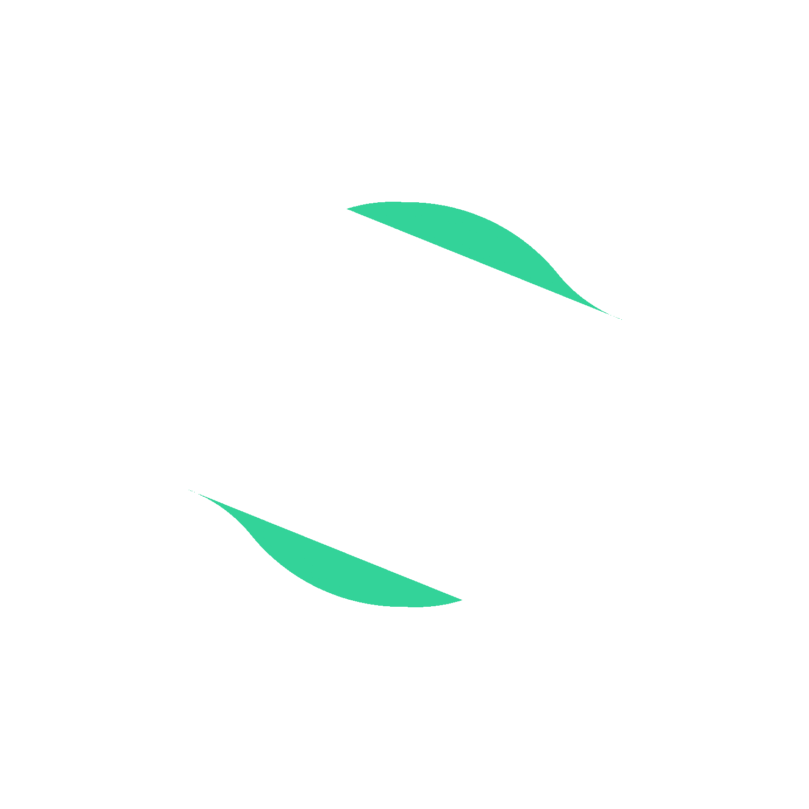

  

## ▪️ About Me ▪️ 
 
Hello World! 👋 I'm Edwardking, a Computer Science student on an exhilarating journey to become a full-stack developer.  
But why stop there? My curiosity is as boundless as the cloud itself, and that's where I'm headed next. Cloud 
computing is on my horizon, and I'm eager to explore the vast expanse of scalable solutions and distributed systems.  
 
Ultimately, my compass points towards the enigmatic and ever-evolving world of AI   and Machine Learning. 
  It's here that I aim to merge my passion for technology with  the power of algorithms, driving innovation that learns, adapts, and improves. 
   
  Technology has always been my playground, and computers, my loyal companions. I thrive on problem-solving and relish challenges that stretch the limits of imagination, creativity, and logical thinking.
   
   

  ## ▪️ Learning Progress ▪️ 
 
   
   
  

        
 
             &nbsp;&nbsp;&nbsp;&nbsp;&nbsp;&nbsp;&nbsp;&nbsp;&nbsp;
             &nbsp;&nbsp;&nbsp;&nbsp;&nbsp;&nbsp;&nbsp;&nbsp;&nbsp;
            
        

  
 &nbsp;&nbsp;&nbsp;&nbsp;  &nbsp;&nbsp;&nbsp;&nbsp;     

 
 
       &nbsp;&nbsp;&nbsp;&nbsp;&nbsp;&nbsp;&nbsp;&nbsp;&nbsp;
       &nbsp;&nbsp;&nbsp;&nbsp; 
 

 
  &nbsp;&nbsp;&nbsp;&nbsp;  &nbsp;&nbsp;&nbsp; 

  

  

   

  ## ▪️ Projects ▪️

  

### Personal & University Projects
- **[C++ E-Commerce Console App](https://github.com/Eddking-QS/Projects-eCommerce_App)** **- My 1st year, end of 1st semester C++ project**
- **Portfolio Website** - **Currently in development. Check status at (_url unavailable at the moment_) .**

 

### FCC Certification Projects (HTML/CSS)
- **[Survey Form](https://github.com/Eddking-QS/FCC-Survey_Form)** **- Simple survey form page made with HTML and CSS.**
- **[Tribute Page](https://github.com/Eddking-QS/Projects-Tribute_Page)** **- A Tribute/Memorial page for a pet dog called Ace.** 
- **[Technical Documentation Page](https://github.com/Eddking-QS/Projects-Technical_Documentation_Page)** **- A blog containing the best tools for each stage in the development cycle.**
- **[Product Landing Page](https://github.com/Eddking-QS/Projects-Product_Landing_Page)** **- A product landing page for the Samsung Galaxy Watch.**
- **Portfolio Website** - **Website in development. Check status at (_url unavailable at the moment_) .**

 

### FCC Certification Projects (Javascript)
- 

 
 
<table align="center">
  <thead>
    <tr>
      <th colspan="3" width="1000">MINI PROJECTS</th>
    </tr>
  </thead>
  <tbody>
    <tr>
      <td align="center" colspan="3" width="1000">Click On The Project Name To View</td>
    </tr>      
    <tr>
      <th align="center" width="300">HTML   CSS   Tailwind CSS</th>
      <td width="700"> 
        <a href="https://github.com/Eddking-QS/HTML-Mini-Project-CookieMonster">Cookie Monster Portfolio Website</a> &nbsp ▪︎ &nbsp <a href="https://github.com/Eddking-QS/HTML-Mini_Projects-CatPhotoApp">Cat Photo App</a> &nbsp ▪︎ &nbsp <a href="https://github.com/Eddking-QS/CSS-Mini_Projects-Cafe_Menu">Cafe Menu</a> &nbsp ▪︎ &nbsp <a href="https://github.com/Eddking-QS/CSS-Mini_Project-Markers">CSS Color Markers</a> &nbsp ▪︎ &nbsp <a href="https://github.com/Eddking-QS/CSS-Mini_Projects-Cafe_Menu">Cafe Menu</a> &nbsp ▪︎ &nbsp <a href="https://github.com/Eddking-QS/CSS-Mini_Project-Markers">CSS Color Markers</a> &nbsp ▪︎ &nbsp <a href="https://github.com/Eddking-QS/HTML-Mini_Projects-Registration_Form">Registration Form</a> &nbsp ▪︎ &nbsp <a href="https://github.com/Eddking-QS/CSS_Mini-Projects_Rothko_Painting">Rothko Painting</a> &nbsp ▪︎ &nbsp <a href="https://github.com/Eddking-QS/CSS-Mini_Projects-Gallery">Gallery</a> &nbsp ▪︎ &nbsp <a href="https://github.com/Eddking-QS/CSS-Mini_Projects-Nutrition_Label">Nutrition Label</a> &nbsp ▪︎ &nbsp <a href="https://github.com/Eddking-QS/Mini_Projects-Accessibility_Quiz">Accessibility Quiz</a> &nbsp ▪︎ &nbsp <a href="https://github.com/Eddking-QS/CSS-Mini_Projects-Balance_Sheet">Balance Sheet</a> &nbsp ▪︎ &nbsp <a href="https://github.com/Eddking-QS/CSS-Mini_Projects-Cat_Painting">Cat Painting</a> &nbsp ▪︎ &nbsp <a href="https://github.com/Eddking-QS/CSS-Mini_Projects-Piano">Piano</a> &nbsp ▪︎ &nbsp <a href="https://github.com/Eddking-QS/CSS-Mini_Projects-City_Skyline">City Skyline</a> &nbsp ▪︎ &nbsp <a href="https://github.com/Eddking-QS/CSS-Mini_Projects-Magazine">Magazine</a> &nbsp ▪︎ &nbsp <a href="https://github.com/Eddking-QS/CSS-Mini_Projects-Ferris_Wheel">Ferris Wheel</a> &nbsp ▪︎ &nbsp <a href="https://github.com/Eddking-QS/CSS-Mini_Projects-Animated_Penguin">Animated Penguin</a>
      </td>
    </tr>
    <tr>
      <th align="center" width="300">Javascript</th>
      <td align="center" width="700">
      </td>
    </tr>
  </tbody>
</table>

 
  

  
    

  ## ▪️ Github Stats ▪️
   

  
 
    
  
  &nbsp;&nbsp;&nbsp;&nbsp;&nbsp;&nbsp;
  
   
    
  
   

  
 

  ## ▪️ Let's Connect ▪️ 
    
I'm always open to discussions, ideas, collaborations, or simply networking. Here's how you can reach me:

- Questions & Answers: <a href="https://stackoverflow.com/users/24184245/edwardking">Stack Overflow</a>
- Connect with me on: <a href="https://www.linkedin.com/in/edwardking-quintin-sey-b2088430b/">LinkedIn</a>
- Follow me on Twitter: <a href="https://twitter.com/IamKing_exe">Twitter</a>
- Follow me on:  <a href="https://www.tiktok.com/@edd..king">TikTok</a>
- Send me an email at: eddkingqsey [at] gmail [dot] com

Looking forward to hearing from you!
  
  
  

